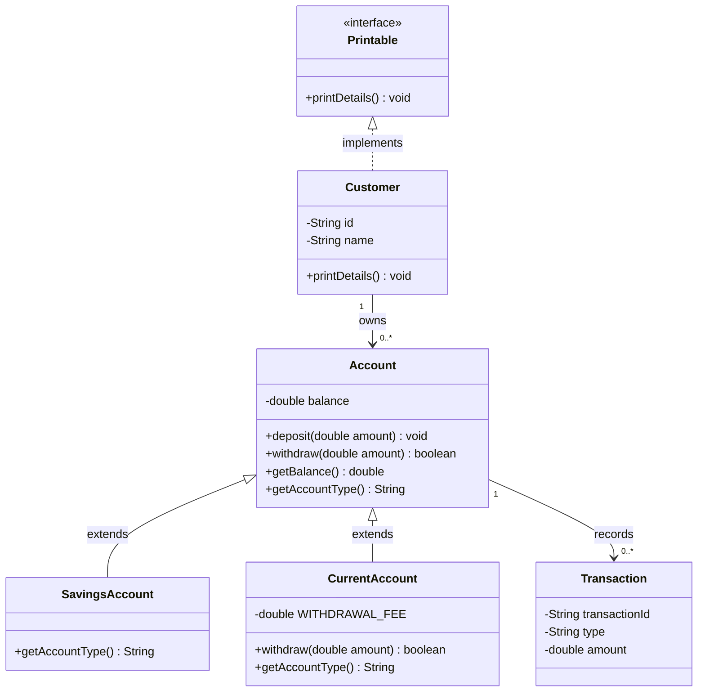

# Banking mini UML

- balance is private (-).
  - yes, because Account class only has access to it 
- Public operations use +.
  - Yes they all do 
- Both account subclasses point toward Account.
  - yes they do, they both extend it 
- Customer realizes Printable with the dotted relationship.
  - Customer implements Printable 
- Multiplicities agree with Exercise 1.
  - One Customer can own zero or more Accounts, and one Account can record zero or more Transactions.

- Inheritance: SavingsAccount and CurrentAccount are specialized Accounts.
- Interface realization: Customer promises Printable behavior.
- Association: One Customer may own many Accounts.
- Association: One Account may record many Transactions.

### Lab 8 Criteria
| # | Confirm | Your notes |
| - | ------- | ---------- |
| 1 | Diagram includes all six types | Pass  |
| 2 | Inheritance and interface arrows are correct | Pass  |
| 3 | Customer–Account and Account–Transaction multiplicities appear | Pass  |
| 4 | You can explain the three relationship types | Pass  |