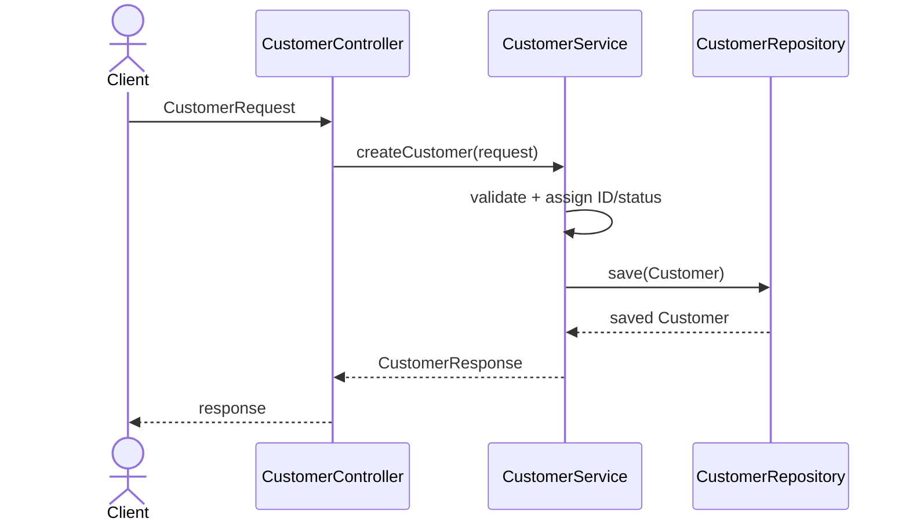
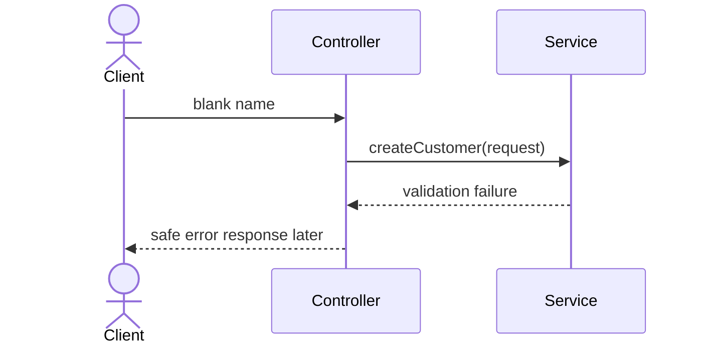

## Now
- Package names and stub responsibilities
- Plain Java types that compile
- Documented flow

## Later
- Spring controller annotations
- Validation annotations
- Repository implementation/JPA
- HTTP response mapping
- Correlation-ID logging

| Readiness check | Result    |
| --------------- |-----------|
| I can locate each class package | Pass      |
| I can explain controller → service → repository | Pass  |
| I distinguish DTO from entity | Pass  |
| I have not added Spring/JPA/database code | Pass  |
| I am ready to build the full Maven skeleton in Lab 8 | Pass  |
