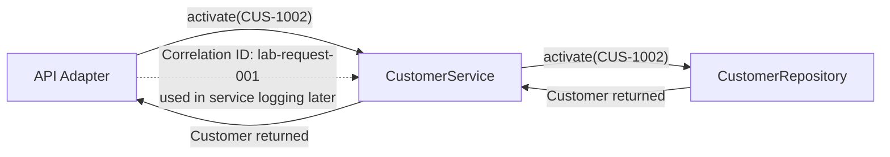

# Lab 15 — Layer Diagram

## Step 1 — Boxes

Draw three boxes: API adapter, CustomerService, CustomerRepository.

## Step 2 — Arrow labels

Label activate(CUS-1002) flowing inward; Customer returned outward.

## Step 3 — Correlation

Note lab-request-001 crosses the API edge into service logging later.

## Scope
Pre-lab only — do not finish the full graded lab in this exercise.